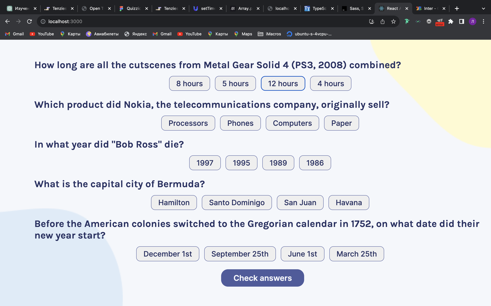
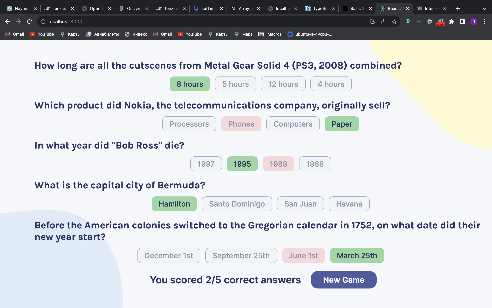

# Quizzzical

Quizzzical is a web-based quiz application that allows you to test your knowledge in various subjects. Whether you're a trivia enthusiast or looking to learn something new, Quizzzical has got you covered.

## Table of Contents

- [Features](#features)
- [Getting Started](#getting-started)
- [Installation](#installation)
- [Usage](#usage)
- [Contributing](#contributing)
- [License](#license)
- [Contact](#contact)

## Features

List some of the key features and functionalities of your project. You can use bullet points for this section.

- **Quiz Questions:** Engage in a challenging quiz with multiple-choice questions.
- **Scoring:** Keep track of your correct answers and see your final score.
- **Random Questions:** Questions are randomly fetched from a trivia API.
- **User-Friendly Interface:** An intuitive and responsive user interface for a seamless quiz experience.
- **Check Answers:** After answering questions, you can check your answers to see which ones were correct.
- **New Game:** Start a new quiz round with fresh questions.

## Getting Started

These instructions will help you get a copy of the project up and running on your local machine.

### Prerequisites

Before you begin, ensure you have met the following requirements:

- **Node.js:** Make sure you have Node.js installed. You can download it from [nodejs.org](https://nodejs.org/).

### Installation

Follow these steps to install and run the project:

1. Clone this repository to your local machine:

   ```bash
   git clone https://github.com/oglenyaboss/quizzzical.git
   
2. Navigate to the project directory:

   ```bash
   cd quizzzical
   ```
   
3. Install the project dependencies:

   ```bash
    npm install
    ```


## Usage

To run the project, use the `npm start` command:

```bash
npm start
```

The project will be available at `http://localhost:3000`.

## Contributing

To contribute to this project, follow these steps:

1. Fork this repository.
2. Create a branch: `git checkout -b <branch_name>`.
3. Make your changes and commit them: `git commit -m '<commit_message>'`.
4. Push to the original branch: `git push origin <project_name>/<location>`.
5. Create the pull request.
6. Alternatively, see the GitHub documentation on [creating a pull request from a fork](https://docs.github.com/en/github/collaborating-with-issues-and-pull-requests/creating-a-pull-request-from-a-fork).

## License

This project uses the [MIT License](LICENSE.md).

[](LICENSE.md)

## Contact

How to reach me: [Email](mailto:oglenyaboss@icloud.com) | [LinkedIn](https://www.linkedin.com/in/lenya-lozhkin-370426292/) | [Twitter](https://twitter.com/oglenyaboss)

---

<p align="center">Made with ❤️ by <a href="t.me/oglenya">Lenya</a>